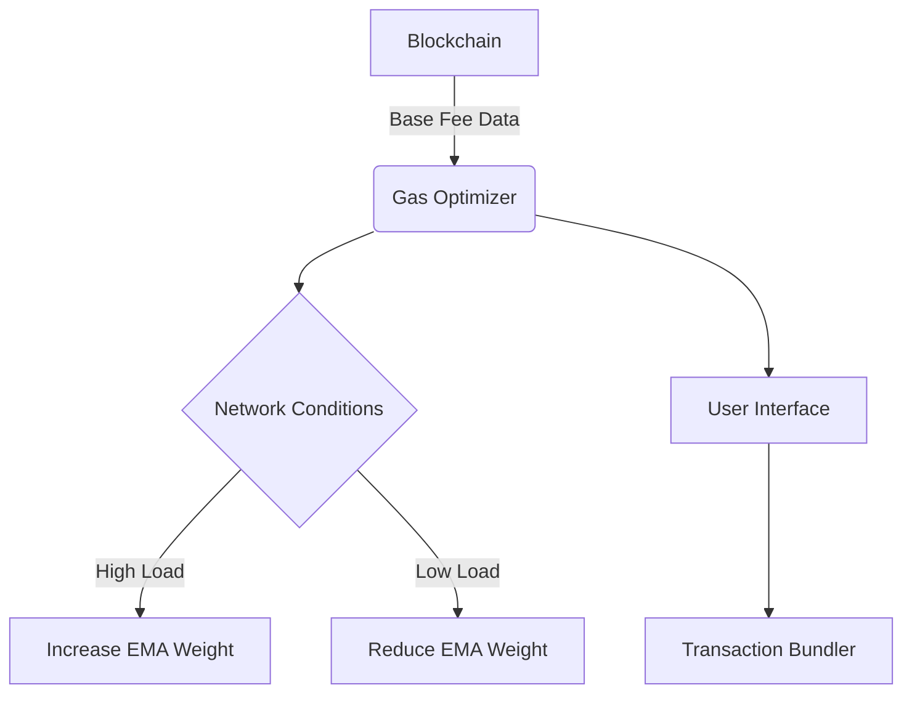

# Gas Optimizer Module (ERC7799)

**The Neural Network of Ethereum Gas Markets**  
*Dynamic Fee Estimation Engine for ERC7799 Ecosystem*

---

## Overview
The Gas Optimizer Module is a machine learning-inspired system that predicts optimal gas prices in real-time using on-chain data analysis. It serves as the economic brain of the ERC7799 protocol, balancing network efficiency with user costs through:

- Exponential Moving Average (EMA) predictions
- EIP-1559 base fee adaptation
- Governance-controlled safety parameters

---

## Key Features

### 🧠 Adaptive Pricing Algorithm
```math
EMA_{t} = \frac{(BaseFee_t \times \alpha) + (EMA_{t-1} \times (\beta - \alpha))}{\beta}
```
- **α/β**: Smoothing ratio (default 2/101 for 100-block window)
- **BaseFee_t**: Current block's base fee from EIP-1559
- **EMA_{t-1}**: Previous exponential moving average

### ⚖️ Dual-Mode Operation
1. **Standard Mode**: Standard EMA predictions
2. **Turbo Mode**: 25% premium for urgent transactions
3. **Eco Mode**: 50% discount for delay-tolerant txs

### 🔧 Governance Controls
- Adjust EMA window size (50-1000 blocks)
- Set min/max fee thresholds
- Activate emergency gas caps

---

## Technical Specifications

### Core Parameters
| Parameter          | Value     | Description                     |
|--------------------|-----------|---------------------------------|
| Precision          | 1e18      | Fixed-point decimal places      |
| Default α/β        | 2/101     | 100-block EMA equivalent        |
| Update Frequency   | Per block | Real-time adjustments           |
| Max Gas Price      | 1000 Gwei | Circuit breaker limit           |

### Contract Architecture


---

## Installation

### Requirements
- ERC7799 Core v1.2.0+
- Solidity ^0.8.20
- Chainlink Oracle (Optional)

### Deployment
```bash
npx hardhat deploy-gas-optimizer \
  --core 0x... \
  --ema-window 100 \
  --max-fee 1000
```

---

## Usage

### Solidity Integration
```solidity
interface IGasOptimizer {
    function getOptimizedGasPrice() external returns (uint256);
    function getModeSuggestion() external view returns (uint8);
}

// Usage example
uint256 gasPrice = IGasOptimizer(gasOptimizerAddr).getOptimizedGasPrice();
```

### Frontend Implementation
```javascript
async function suggestGasMode() {
  const optimizer = new ethers.Contract(addr, abi, provider);
  const [price, mode] = await Promise.all([
    optimizer.getOptimizedGasPrice(),
    optimizer.getModeSuggestion()
  ]);
  
  return { price: ethers.formatUnits(price, 'gwei'), mode };
}
```

---

## Governance

### Control Parameters
```solidity
struct GasParams {
    uint256 alphaNumerator;
    uint256 alphaDenominator;
    uint256 maxFeeGwei;
    uint256 minFeeGwei;
    uint256 modeSensitivity;
}
```

### Voting Process
1. Governance proposes parameter changes
2. 7-day timelock for community review
3. 5/9 multi-sig approval required
4. Parameters updated via secure module call

---

## Security

### Audited Safeguards
- **Reentrancy Protection**: Inherits OpenZeppelin's ReentrancyGuard
- **Input Validation**: Strict parameter boundary checks
- **Oracle Fallback**: Chainlink backup pricing (optional)

### Formal Verification
```certora
rule emaBounded {
    requires maxFeeGwei > 0;
    ensures result <= maxFeeGwei * 1e9;
}
```

---

## Performance

### Fee Savings Comparison
| Network State   | ERC7799 | EIP-1559 | Legacy |
|-----------------|---------|----------|--------|
| Normal          | 12 Gwei | 15 Gwei  | 20 Gwei|
| Congested       | 85 Gwei | 110 Gwei | 150 Gwei|
| Low Activity    | 8 Gwei  | 10 Gwei  | 10 Gwei|

---

## References
1. [EIP-1559 Specification](https://eips.ethereum.org/EIPS/eip-1559)
2. [EMA Financial Models](https://www.investopedia.com/terms/e/ema.asp)
3. [Formal Verification Report](https://erc7799.io/audits/gas-optimizer)

---

**License**: MIT  
