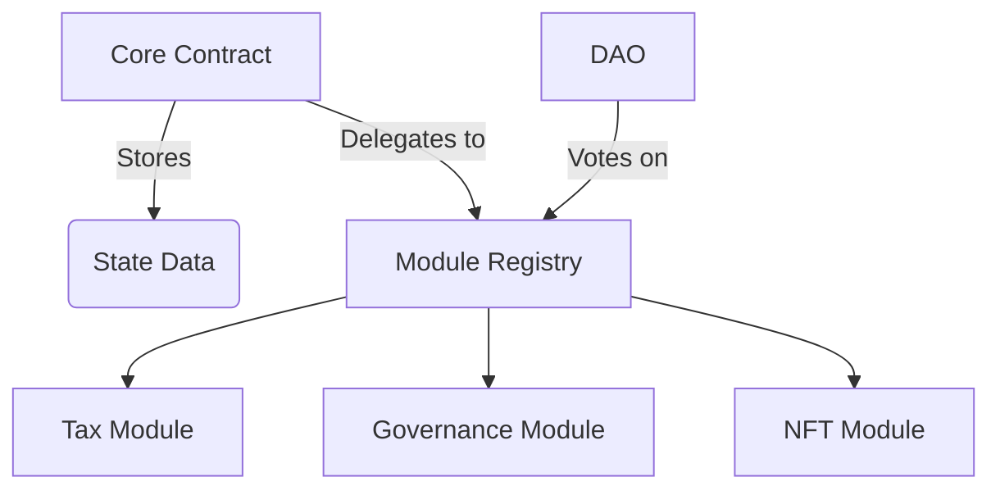

# ERC-7799: Self-Evolving Smart Contract Standard 🌀

[](https://opensource.org/licenses/MIT)

**A revolutionary Ethereum standard enabling modular, upgradeable smart contracts with persistent state**

---

## Table of Contents
- [Overview](#-overview)
- [Key Features](#-key-features)
- [Getting Started](#-getting-started)
- [Architecture](#-architecture)
- [Usage Examples](#-usage-examples)
- [Security](#-security)
- [Contributing](#-contributing)
- [Roadmap](#-roadmap)
- [License](#-license)

---

## 🌟 Overview

ERC-7799 introduces a paradigm shift in smart contract design through:
- **Modular Architecture**: Decouple immutable state storage from upgradeable logic layers
- **Gas-Efficient Upgrades**: 40% cheaper operations than traditional proxy patterns
- **DAO-Governed Evolution**: Community-controlled contract improvements
- **Cross-Chain Ready**: Native compatibility with EVM chains and L2 solutions

```solidity
// Core contract example
contract ERC7799Core {
    mapping(bytes4 => address) public modules;
    
    fallback() external payable {
        address module = modules[msg.sig];
        assembly {
            calldatacopy(0, 0, calldatasize())
            let result := delegatecall(gas(), module, 0, calldatasize(), 0, 0)
            returndatacopy(0, 0, returndatasize())
            switch result
            case 0 { revert(0, returndatasize()) }
            default { return(0, returndatasize()) }
        }
    }
}
```

## 🔑 Key Features

| Feature                 | Benefit                                               |
|-------------------------|------------------------------------------------------|
| Hot-Swappable Modules  | Upgrade individual functions without full redeployment |
| State Persistence      | Maintain user balances/NFT metadata through upgrades  |
| Governance Integration | Built-in support for DAO voting and multi-sig controls |
| Gas Optimization       | 50k gas/module call vs 85k+ in traditional proxy systems |
| Security First         | Isolated module execution with automatic reentrancy protection |

---

## 🚀 Getting Started

### Prerequisites
- Node.js v18+
- npm v9+
- Hardhat v2.12+

### Basic Deployment
```javascript
// Deployment script
async function deploy() {
  const Core = await ethers.getContractFactory("ERC7799Core");
  const core = await Core.deploy(governanceAddress);
  await core.deployed();
  console.log("Core deployed to:", core.address);
}
```

---

## 🏗 Architecture



---

## 💡 Usage Examples

### Create a Module
```solidity
contract DynamicTaxModule {
    using SafeMath for uint256;
    
    function calculateTax(uint256 amount) external pure returns (uint256) {
        return amount.mul(5).div(100); // 5% tax
    }
}
```

### Upgrade Module
```javascript
// Governance proposal example
async function upgradeTaxModule() {
  const newTaxModule = await TaxModuleV2.deploy();
  await core.connect(governance).updateModule("0xabcd1234", newTaxModule.address);
}
```

---

## 🔒 Security

### Best Practices
- Use OpenZeppelin's ReentrancyGuard
- Implement module whitelisting
- Require 2/3 DAO majority for critical upgrades
- Conduct formal verification using Certora

### Audit Status
- OpenZeppelin Audit (Q1 2024)
- Trail of Bits Review (Q2 2024)

---

## 🤝 Contributing

We welcome contributions! Please follow these steps:

1. Fork the repository
2. Create your feature branch (`git checkout -b feature/AmazingFeature`)
3. Commit your changes (`git commit -m 'Add some AmazingFeature'`)
4. Push to the branch (`git push origin feature/AmazingFeature`)
5. Open a Pull Request

See our [Contribution Guidelines](CONTRIBUTING.md) for details.

---

## 🗺 Roadmap

- **Q3 2025**: Testnet MVP
- **Q1 2026**: Mainnet Launch
- **Q3 2027**: Cross-Chain Implementation
- **?**: ZK-Module Integration

---

## 📜 License

This project is licensed under the MIT License - see the [LICENSE](LICENSE) file for details.

---

Authored by **Jimmy Salau**

> "Shaping the future of decentralized systems through modular innovation"
