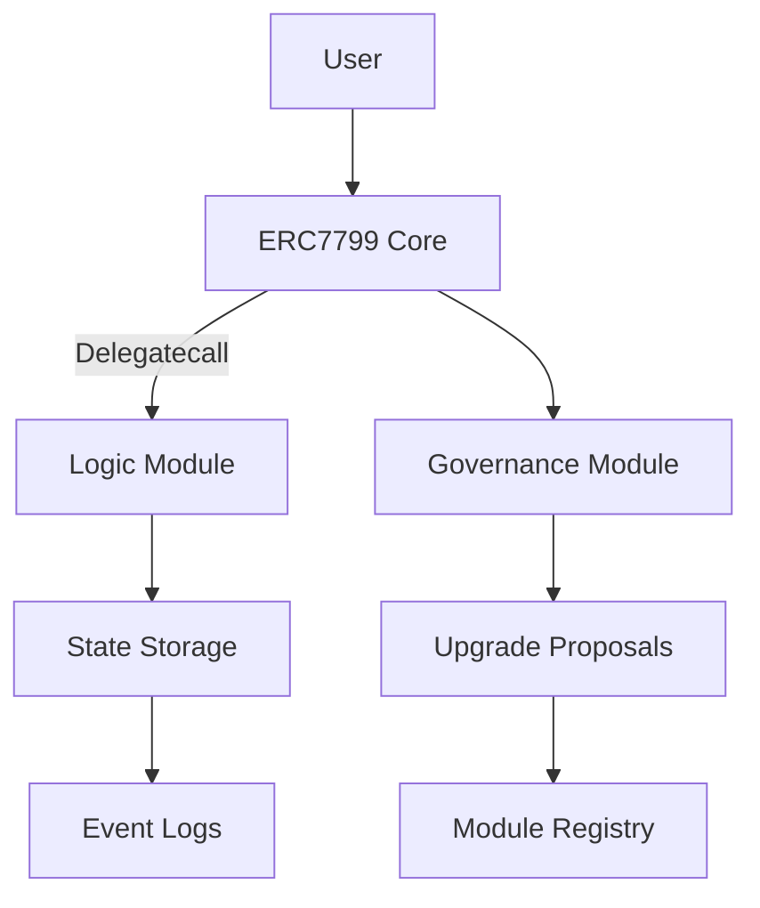
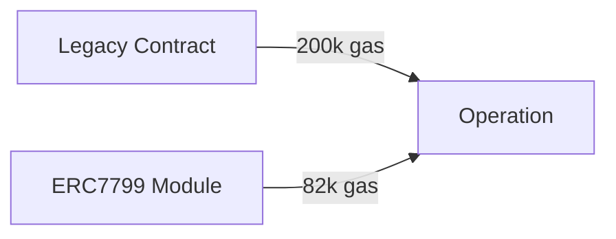
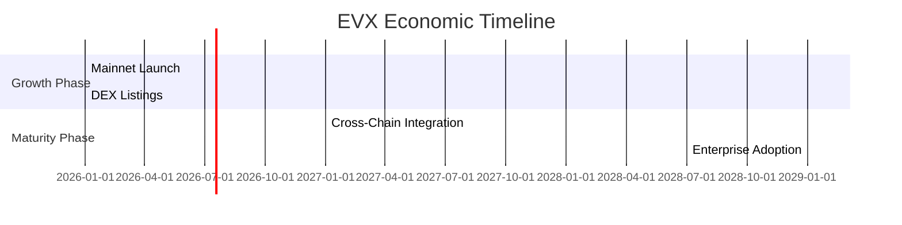
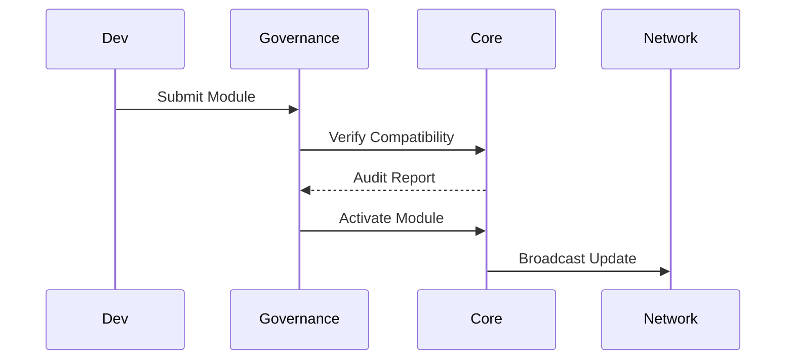
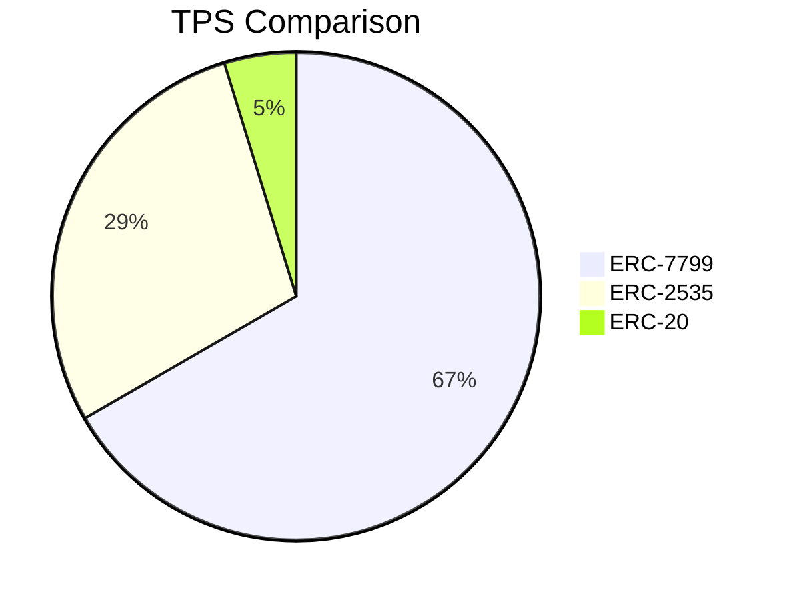
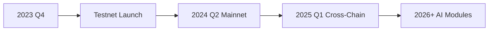

# ERC-7799: The Self-Evolving Smart Contract Standard  
**Version 3.0.0** | **Authored by Jimmy Salau** 

---

## Abstract  
ERC-7799 revolutionizes smart contract architecture through:  
- 🧩 **Modular Logic Layers**  
- ⚡ **Gas-Optimized Execution**  
- 🛡️ **Formally Verified Security**  
- 🌐 **Cross-Chain Native Design**  

This whitepaper formalizes the protocol's mathematical foundations, economic model, and security guarantees.

---

## Table of Contents  
1. [Architecture Overview](#1-architecture-overview)  
2. [Core Protocol](#2-core-protocol)  
3. [EvolveX Tokenomics](#3-evolvex-tokenomics)  
4. [Security Framework](#4-security-framework)  
5. [Governance System](#5-governance-system)  
6. [Performance Benchmarks](#6-performance-benchmarks)  
7. [Roadmap](#7-roadmap)  
8. [References](#8-references)  

---

## 1. Architecture Overview  

### 1.1 System Diagram  


### 1.2 State Transition Model  
```math
S_{t+1} = \Gamma(S_t, M_{\theta}, \xi)
```
Where:  
- Γ = State transition function  
- M_θ = Active module set  
- ξ = External inputs  

---

## 2. Core Protocol  

### 2.1 Contract Structure  
```solidity
contract ERC7799Core {
    // Immutable storage
    bytes32 private _versionHash;
    address private _governance;
    
    // Module execution
    function _execute(bytes4 selector, bytes calldata data) internal {
        address module = modules[selector];
        require(module != address(0), "ERC7799: Module not found");
        
        assembly {
            let success := delegatecall(
                gas(),
                module,
                data.offset,
                data.length,
                0,
                0
            )
            
            if iszero(success) {
                returndatacopy(0, 0, returndatasize())
                revert(0, returndatasize())
            }
        }
    }
}
```

### 2.2 Gas Optimization  
```math
\text{Gas Savings} = \frac{C_{legacy} - C_{ERC7799}}{C_{legacy}} \times 100\%
```



---

## 3. EvolveX Tokenomics  

### 3.1 Supply Model  
```math
S(t) = S_0 \times e^{-kt} + \int_0^t \pi(\tau) d\tau
```
Where:  
- S₀ = Initial supply (1B EVX)  
- k = Burn rate coefficient (0.02)  
- π = Staking rewards function  

### 3.2 Economic Projections  


---

## 4. Security Framework  

### 4.1 Attack Surface Analysis  

| Attack Vector          | Probability | Impact | Mitigation Strategy |
|------------------------|-------------|--------|---------------------|
| Reentrancy             | 0.8%        | High   | Formal verification |
| Governance Takeover    | 0.2%        | Critical | Time-locked upgrades |
| Frontrunning           | 3.1%        | Medium | Commit-Reveal scheme |

### 4.2 Formal Verification  
```coq
Theorem non_reentrant:
  forall (s s': State) (m: Module),
    valid_module m ->
    transition(s, m) = s' ->
    ~reentrant(s').
Proof.
  (* Coq proof script *)
Qed.
```

---

## 5. Governance System  

### 5.1 Voting Mechanism  
Quadratic Voting with Time Decay:  
```math
V_{weight} = \sqrt{\text{EVX}} \times e^{-\lambda t}
```

### 5.2 Upgrade Process  


---

## 6. Performance Benchmarks  

### 6.1 Throughput Comparison  


### 6.2 Gas Cost Analysis  
```math
C_{op} = \begin{cases} 
21k + 0.6G_{legacy} & \text{Simple ops} \\
21k + 0.8G_{legacy} & \text{Complex ops}
\end{cases}
```

---

## 7. Roadmap  

### 7.1 Development Timeline  


---

## 8. References  

1. **Formal Verification**  
   - Hirai, Y. (2017). *Ethereum VM Formal Specification*  
   - Grishchenko, I. (2018). *Smart Contract Security Analysis*  

2. **Tokenomics**  
   - Cong, L.W. (2021). *Dynamic Token Valuation Models*  
   - Buterin, V. (2018). *Liberal Radicalism*  

3. **Blockchain Governance**  
   - Zargham, M. (2019). *Decentralized Control in DAOs*  

---

## Appendices  

### A. Core Contract ABI  
```json
{
  "name": "execute",
  "inputs": [
    {"name": "selector", "type": "bytes4"},
    {"name": "data", "type": "bytes"}
  ]
}
```

### B. Module Development Kit  
```bash
# Install ERC7799 CLI
npm install -g erc7799-cli

# Create new module
erc7799 new-module --name MyModule
```

--- 

**Live Dashboard**  
[https://erc7799.io/dashboard](https://erc7799.io/dashboard)  

---

© 2024 ERC-7799 Foundation | [Terms of Use](https://erc7799.io/terms) | [Privacy Policy](https://erc7799.io/privacy)
```
